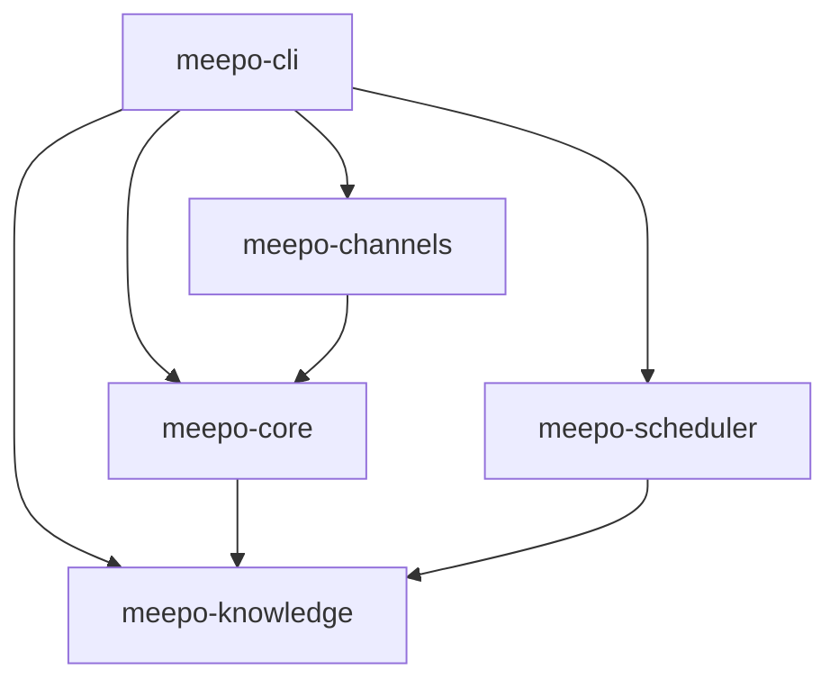
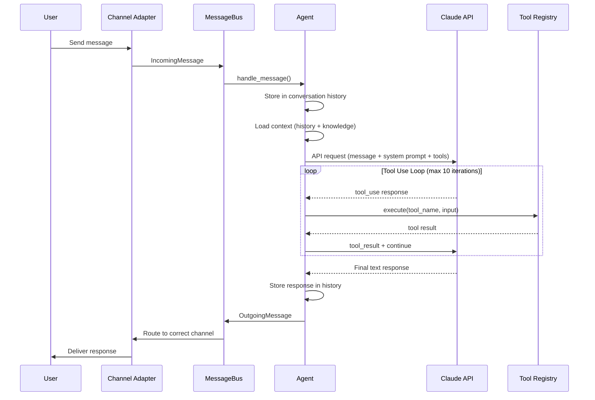
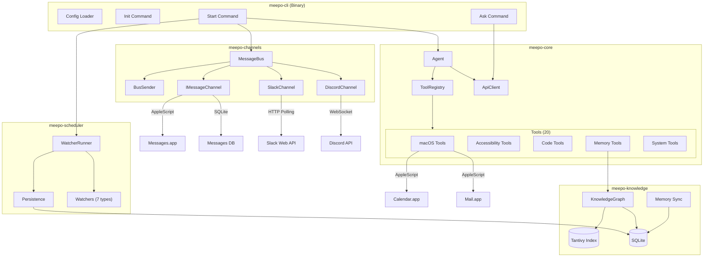
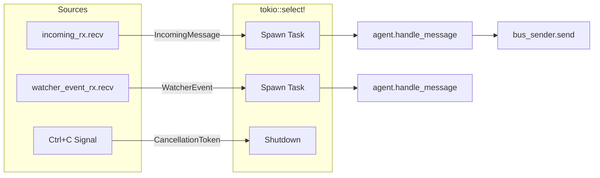
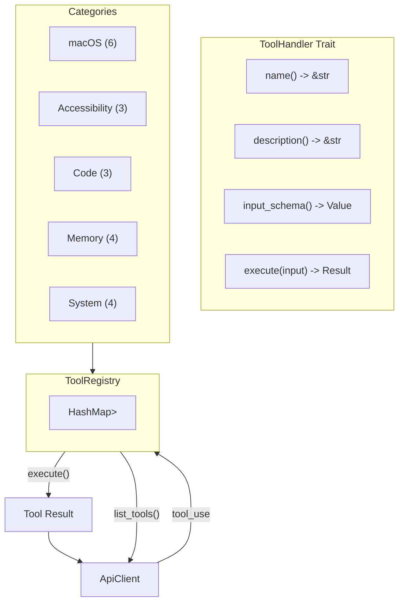
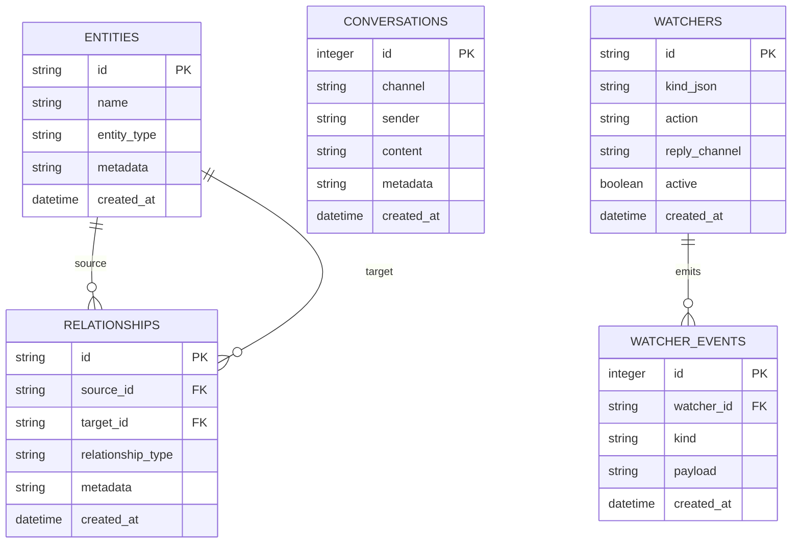
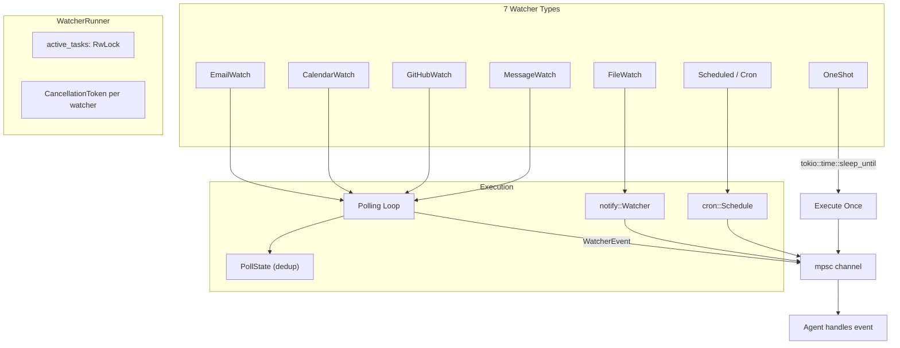
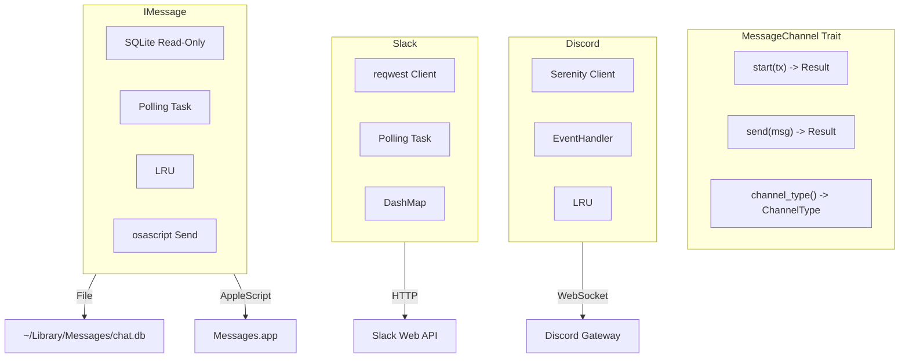
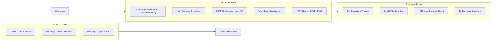

# Meepo Architecture

## Overview

Meepo is a 5-crate Rust workspace implementing a local AI agent for macOS. It connects Claude to messaging channels (Discord, Slack, iMessage), gives it access to 20 tools, and maintains a persistent knowledge graph.

## Crate Dependency Graph

| Crate | Purpose | Key Types |
|-------|---------|-----------|
| `meepo-cli` | Binary entry point, config, subcommands | `Cli`, `MeepoConfig` |
| `meepo-core` | Agent loop, API client, tool system | `Agent`, `ApiClient`, `ToolRegistry` |
| `meepo-channels` | Channel adapters and message routing | `MessageBus`, `MessageChannel` |
| `meepo-knowledge` | SQLite + Tantivy persistence | `KnowledgeDb`, `KnowledgeGraph`, `TantivyIndex` |
| `meepo-scheduler` | Watcher runner and event system | `WatcherRunner`, `Watcher`, `WatcherEvent` |

## Message Flow

## System Architecture

## Event Loop

The main event loop runs in `cmd_start()` using `tokio::select!` across three sources:

The bus is split into a receiver (`mpsc::Receiver<IncomingMessage>`) and an `Arc<BusSender>` to allow concurrent send/receive without borrow conflicts.

## Tool System

Tools implement the `ToolHandler` trait and are registered in a `ToolRegistry` (HashMap-backed). The agent's API client runs a tool loop that executes tools until Claude returns a final text response or hits the 10-iteration limit.

### Tool List

| Tool | Description | Implementation |
|------|-------------|----------------|
| `read_emails` | Read recent emails from Mail.app | AppleScript via `osascript` |
| `read_calendar` | Read upcoming calendar events | AppleScript via `osascript` |
| `send_email` | Send email via Mail.app | AppleScript (sanitized input) |
| `create_event` | Create calendar event | AppleScript (sanitized input) |
| `open_app` | Open macOS application | `open -a` command |
| `get_clipboard` | Read clipboard contents | `pbpaste` command |
| `read_screen` | Read focused app/window info | AppleScript accessibility |
| `click_element` | Click UI element by name | AppleScript accessibility |
| `type_text` | Type text into focused app | AppleScript keystroke |
| `write_code` | Delegate coding to Claude CLI | `claude` CLI subprocess |
| `make_pr` | Create GitHub pull request | `git` + `gh` CLI |
| `review_pr` | Analyze PR diff for issues | `gh pr view` + diff analysis |
| `remember` | Store entity in knowledge graph | SQLite + Tantivy insert |
| `recall` | Search entities by name/type | SQLite query |
| `search_knowledge` | Full-text search knowledge graph | Tantivy search |
| `link_entities` | Create relationship between entities | SQLite insert |
| `run_command` | Execute shell command (allowlisted) | `sh -c` with 30s timeout |
| `read_file` | Read file contents | `tokio::fs::read_to_string` |
| `write_file` | Write file contents | `tokio::fs::write` |
| `browse_url` | Fetch URL content | `reqwest` with SSRF protection |

## Knowledge Graph

The knowledge layer has two backends:
- **SQLite** (`KnowledgeDb`) — Stores entities, relationships, conversations, and watchers with indexed queries
- **Tantivy** (`TantivyIndex`) — Full-text search index over entity content, returning relevance-ranked results

`KnowledgeGraph` combines both, indexing entities in Tantivy on insert and delegating searches to the appropriate backend.

## Watcher System

Watchers run as independent tokio tasks managed by `WatcherRunner`. Each has a `CancellationToken` for graceful shutdown. Polling watchers use `PollState` with `HashSet<u64>` for deduplication across cycles.

## Channel Adapters

| Channel | Connection | Receive | Send | Reply Tracking |
|---------|-----------|---------|------|----------------|
| Discord | WebSocket via Serenity | EventHandler callback | HTTP via `channel_id.say()` | LRU cache (1000 entries) |
| Slack | HTTP polling (configurable interval) | `conversations.history` | `chat.postMessage` | DashMap user->channel |
| iMessage | SQLite polling of chat.db | Read-only query by ROWID | AppleScript `send` command | LRU cache (1000 entries) |

## Security Model

